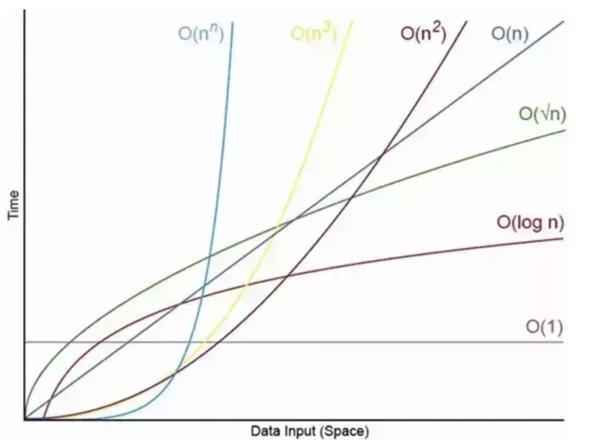

# Big-O


## what is good code?

- readable
- scalable
  - speed (time complicated)
  - memory (space complicated)

---

## Big-O complexity chart


​ x-axis: elements number, y-axis: operations times

---

## Big-O notation

### O(n)

- linear - **for loops, while loops through n times**

```javascript
const boxes = [0,1,2,3,4,5]

function getEachBoxes(input) {
  for (let i = 0; i < input.lengthl i++) {
    console.log(input[i])
  }
}
getEachBoxes(boxes) //O(n)
```

### O(1)

- constant - **no loops**

```javascript
const boxes = [0, 1, 2, 3, 4, 5];

function logFirstTwoBoxes(input) {
  console.log(input[0]); //O(1)
  console.log(input[1]); //O(1)
}
logFirstTwoBoxes(boxes); //O(2)
```

### O(n^2)

- Quadratic - **every element in a collection needs to be compared to ever other element. Two nested loops**

```javascript
const nums = [1, 2, 3, 4, 5, 6, 7, 8, 9];

function nineNineTable(nums) {
  for (let i = 0; i < nums.length; i++) {
    for (let j = 0; j < nums.length; j++) {
      console.log(nums[i] * nums[j]);
    }
  }
}
nineNineTable(nums); //O(n^2)
```

---

## Big-O Rule

- worst case.

- remove constant. ex.O(2n + 3) => O(n)

- different terms of inputs

  ```javascript
  let sayHi = (a, b) => {
    for (let i = 0; i < a; i++) {
      console.log('sayHi');
    }
    for (let j = 0; j < b; j++) {
      console.log('sayHi');
    }
  };
  sayHi(); // big-O => O(a+b)

  let nested = (a, b) => {
    for (let i = 0; i < a; i++) {
      for (let j = 0; j < b; j++) {
        console.log('sayHI');
      }
    }
  };
  nested(); // big-O => O(a*b)
  ```

- drop non doninants. Ex O(n^2 + n + 1) => O(n^2). because when n is grow. The n^2 is growing bigger than other.

---

## what cause space complexity?

- Variables
- Data Structures
- Function Call
- Allocations

---

## QA

### 1. Is O(1) always better than O(n)?

Ans: No it's depend on your situation.
as We will say O(1) will better than O(n). it's because we assume n is a very big number.



### 2. what is important for code? (Readable, speed, memory)?

Ans: it depends on situation. but some times we will sacarfice memory to improve speed. and some times we will sacarfice spped to reduce memory use.
