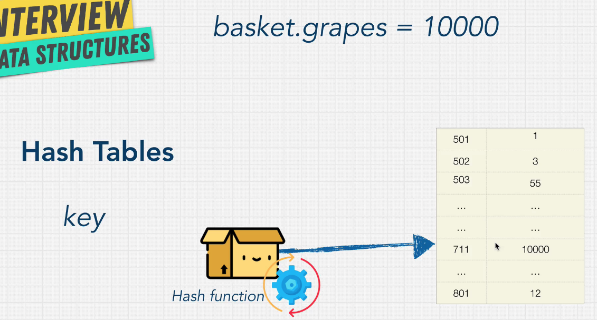

# Hash table

## Introduce hash table

​In javascript we called hash table is **Object** , in python we called it **dictionary** ,
​ E.X. 會將 grapes 這個 key 經過 Hash function 轉變成 711，這樣就能去存 711 位置的值



---

## Big-O

- insert -> O(1)

- Look up -> O(1)

- delete -> O(1)

- search -> O(1)

  **look up** is finding a value based on a key. **Search** is to check if a certain key exists in a Hash table.
  如果發生 collison 那 read 跟 write 就有可能會變成 O(n)

---

## Collision


如果 hash 指到的位置是一樣的，為了克服衝突，就會變成 linked-list 的型態儲存（當然也有其他方式去改），read and write 的 big-O 就會變成 Ｏ(n/k) -> O(n). K 代表 此 hashtable 的 暫存器大小

---

## How to implement Hash table

先寫實作 hash table 的心得，我竟然沒考慮到 collision 的問題，導致我寫出的這個版本，如果 collision 的話，就會爆掉～
作者的版本是有包括 collision 的

- my edition

```javascript
class HashTable {
  constructor(size) {
    this.data = new Array(size);
  }

  _hash(key) {
    let hash = 0;
    for (let i = 0; i < key.length; i++) {
      hash = (hash + key.charCodeAt(i) * i) % this.data.length;
    }
    return hash;
  }
  set(key, value) {
    // console.log(this._hash(key))
    this.data[this._hash(key)] = value;
  }
  get(key, value) {
    console.log(this.data[this._hash(key)]);
    return this.data[this._hash(key)];
  }
}

const myHashTable = new HashTable(50);
myHashTable.set('grapes', 10000);
myHashTable.get('grapes');
myHashTable.set('apples', 9);
myHashTable.get('apples');
```

---

- udemy Edition

```javascript
class HashTable {
  constructor(size) {
    this.data = new Array(size);
    console.log(this.data);
  }

  _hash(key) {
    let hash = 0;
    for (let i = 0; i < key.length; i++) {
      hash = (hash + key.charCodeAt(i) * i) % this.data.length;
    }
    return hash;
  }
  set(key, value) {
    let hash = this._hash(key);
    if (!this.data[hash]) {
      this.data[hash] = [];
    }
    this.data[hash].push([key, value]);
    console.log(this.data);
    return this.data;
  } //O(1)

  get(key) {
    let hash = this._hash(key);
    let item = this.data[hash];
    if (item) {
      for (let i = 0; i < item.length; i++) {
        if (item[i][0] === key) {
          console.log(item[i][1]);
          return item[i][1];
        }
      }
    } else {
      return undefined;
    }
  } //O(1) or O(n) for collision

  keys() {
    if (!this.data.length) {
      return false;
    }
    let keysArray = [];
    for (let i = 0; i < this.data.length; i++) {
      if (this.data[i]) {
        if (this.data[i].length > 1) {
          for (let j = 0; j < this.data[i].length; j++) {
            keysArray.push(this.data[i][j][0]);
          }
        } else {
          keysArray.push(this.data[i][0][0]);
        }
      }
    }
    console.log(keysArray);
    return keysArray;
  } //O(n)
}

const myHashTable = new HashTable(2);
myHashTable.set('grapes', 10000);
myHashTable.get('grapes');
myHashTable.set('apples', 9);
myHashTable.get('apples');
myHashTable.keys();
```

---

## Q1 solve recurring

Description: find first duplicate num in array

```javascript
function firstRecurringCharacter(input) {
  for (let i = 0; i < input.length; i++) {
    for (let j = i + 1; j < input.length; j++) {
      if (input[i] === input[j]) {
        return input[i];
      }
    }
  }
  return undefined;
} //O(n^2)

function firstRecurringCharacter2(input) {
  let res = {};
  for (let i = 0; i < input.length; i++) {
    if (res[input[i]] !== undefined) {
      return input[i];
    } else {
      res[input[i]] = i;
    }
  }
  return undefined;
} //O(n)

function firstRecurringCharacter3(input) {
  // 為了解決 第一個 function 可能會得到錯誤結果 而多新增的，網友提供此 function
  for (let i = 1; i < input.length; i++) {
    for (let j = i - 1; j >= 0; j++) {
      if (input[i] === input[j]) {
        return input[i];
      }
    }
  }
  return undefined;
} //O(n^2) to fixed first fnction

console.log(firstRecurringCharacter([1, 5, 5, 1, 3, 4, 6])); // 1 這function 在某些條件下會拿到跟別人不一樣的結果 要注意
console.log(firstRecurringCharacter2([1, 5, 5, 1, 3, 4, 6])); // 5
console.log(firstRecurringCharacter3([1, 5, 5, 1, 3, 4, 6])); // 5
```

---

## Pros and cons


