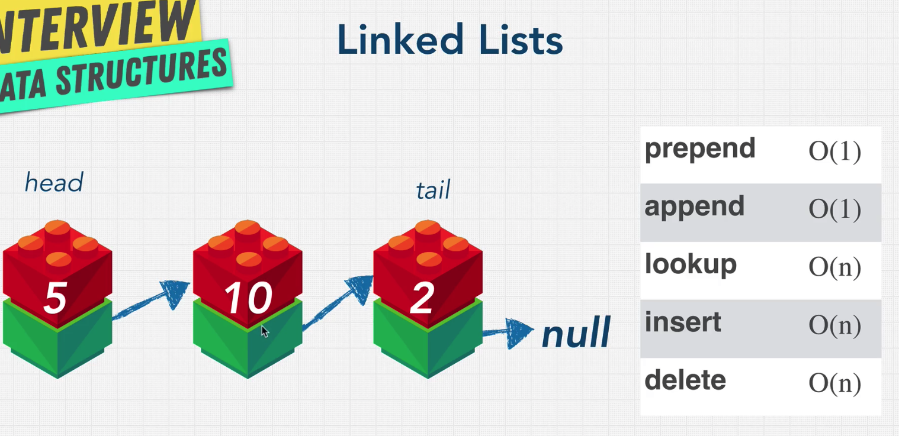
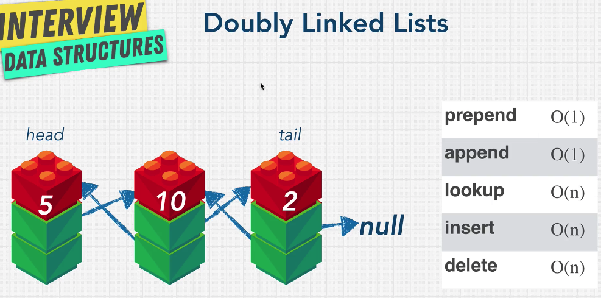

# Linked list

## What it linked list?



know how:

- Head = first node
- Tail = last node => point to null
- No terminated (沒有終止)
- Javascript doesn't have linked list but we can create one
  - Linked list and nodes are scattered(分散) all over memory，like hash table。 But array is located right next to each other

---

## Pros and Cons

**Pros**

- Insert and delete faster than array 因為 array insert 或 delete 之後，還需要把後面的數字在 shift 一波，這時候可能會遇到 array 大小需要擴張。link list 則不用。
- Sorted data compare to hash table

**Cons**

- Finding index = 5 is lower than array，如果要找 index=5，array 可以直接 array[5]，但是 linked list 需要從頭跑到第五個 node 才知道。

---

## What is pointer

```javascript
let obj1 = { a: true };
let obj2 = obj1; // this obj2 is referrence (pointer) to obj 1 memory address.
obj1.a = 'booya';
delete obj1;
console.log(obj2); // {a:true} , still have value because javascript know you still have pointer to obj1
```

---

## Implement linked list

<details><summary>Click me show the codes</summary>
<p>

```javascript
// Create the below linked list:
// myLinkedList = {
//   head: {
//     value: 10
//     next: {
//       value: 5
//       next: {
//         value: 16
//         next: null
//       }
//     }
//   }
// };

class LinkedList {
  constructor(value) {
    this.head = {
      value: value,
      next: null,
    };
    this.tail = this.head;
    this.length = 1;
  }
  append(value) {
    let node = {
      value,
      next: null,
    };
    this.tail.next = node;
    this.tail = node;
    this.length++;
  }
  prepend(value) {
    let headNode = this.head;
    let preHeadNode = {
      value,
      next: headNode,
    };
    this.head = preHeadNode;
    this.length++;
  }
  printList() {
    const array = [];
    let currentNode = this.head;
    while (currentNode !== null) {
      array.push(currentNode.value);
      currentNode = currentNode.next;
    }
    console.log(array);
    return array;
  }
  insert(index, value) {
    if (index <= 0) {
      this.prepend(value);
    } else if (index >= this.length) {
      this.append(value);
    } else {
      let current = this.head;
      for (let i = 1; i < index; i++) {
        current = current.next;
      }
      let node = {
        value,
        next: null,
      };
      let nextNode = current.next;
      current.next = node;
      node.next = nextNode;
      this.length++;
    }
  }
  remove(index) {
    let head = this.head;
    let count = 0;
    if (index <= 0) {
      this.head = head.next;
      this.length--;
    } else if (index >= this.length - 1) {
      while (head) {
        if (count === index - 1) {
          head.next = null;
          this.tail = head;
          this.length--;
          return;
        }
        count++;
        head = head.next;
      }
    } else {
      while (head) {
        if (count === index - 1) {
          head.next = head.next.next;
          this.length--;
          return;
        }
        count++;
        head = head.next;
      }
    }
  }
  reverse() {
    if (!this.head.next) {
      return;
    }
    let head = this.head;
    let prev = head;
    head = head.next;
    prev.next = null;
    this.tail = prev;
    let next = head.next;
    let status = true;
    while (status) {
      head.next = prev;
      prev = head;
      head = next;
      if (head.next) {
        next = head.next;
      } else {
        head.next = prev;
        this.head = head;
        status = false;
      }
    }
    return this;
  }
}

let myLinkedList = new LinkedList(10);
myLinkedList.printList(); // 10
myLinkedList.append(5);
myLinkedList.append(16);
myLinkedList.printList(); // 10 -> 5 -> 16
myLinkedList.prepend(1);
myLinkedList.printList(); // 1 -> 10 -> 5 -> 16
myLinkedList.insert(0, 0);
myLinkedList.printList(); // 0 -> 1 -> 10 -> 5 -> 16
myLinkedList.insert(2, 15);
myLinkedList.printList(); // 0 -> 1 -> 15 -> 10 -> 5 -> 16
myLinkedList.remove(0);
myLinkedList.printList(); // 1 -> 15 -> 10 -> 5 -> 16
myLinkedList.reverse();
myLinkedList.printList(); // 16 -> 5 -> 10 -> 15 -> 1
```

</p>
</details>

---

## Doubly linked list



```javascript
let node = {
  val: null,
  next: null,
  prev: null, // doubly add prev key.
};
```

---

## Single vs Double

### Single

- 優點：

  - 簡單
  - 記憶體少
  - Insertion 和 deletion 普遍比 doubly 還快一點，因為程式碼較少，處理的步驟少。

- 缺點：

  - Head node 的 reference 消失，整個 linked list 就會不見。

- 使用情境：
  - 記憶體少，需要 fast insert and delete 或 searching 較少情境。

### double

- 優點：

  - Iterated or traverse both from the front or from the back。

- 缺點：

  - 記憶體佔用較大。

- 使用期間：
  - 記憶體較充裕，想查詢從前到後或由後到前的時機。

---

## review linked list

- Fast insertion
- Fast deletion
- Ordered
- Flexible size
- Slow LookUp (because need traverse linked list) compare to array and Object, array has index, and Object has key
- More memory
