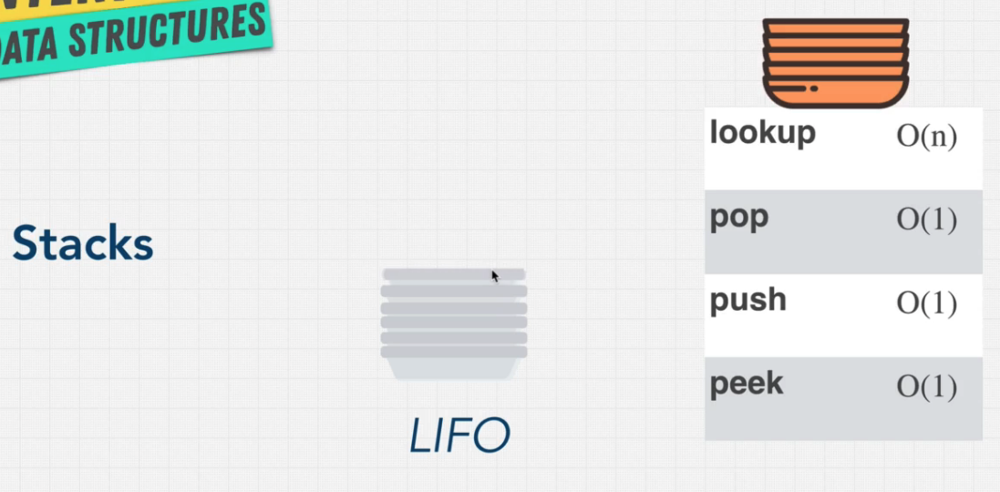
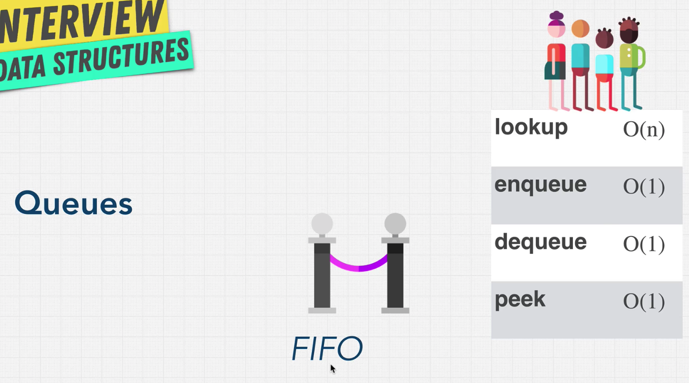

# Stacks and Queues

## Introduce Stack

Stacks has LIFO (Last-In-First-Out)，最晚進入的資料會被最早取出，常見的應用 如（編輯器的 undo, 網頁瀏覽器 回到前一頁, 遞迴 recursion 可以用 stack 改寫, 記憶體管理中的 call stack ）



---

## Introduce queues

Queues has FIFO (First-In-First-Out)，最早進入的會被最早取出，常見例子，演算法 Breadth first search （廣度優先搜尋） 與 tree 的 level-order-traversal，作業系統中的共享資源，例如 request or interrupt, 需要有個 queue 來攀台多個程式的執行順序。



---

## How can I build a stack? Use array or linked list?

先說結論，兩個都差不多，依據你偏好或是優先度較高的選來用

判斷一下 array 跟 linked list 差別

- array 記憶體位置是連續的，access 較快一點，但是如果超過原本 array 記憶體大小的話，他需要額外在 開一個 double 的記憶體大小位置，來複製舊的 array。
- linked list 記憶體位置是分散的，access 較慢一點，而且需要額外記憶體來儲存 pointer，但是他有更多 dynamic memory

---

## How can I build a queue? Use array or linked list?

先說結論 用 **Linked list** 比較好

因為 queues 是 FIFO 所已要常常移掉第一個進入的物品，如果用 array 來移的話，除了移掉第一個位置的 物品，還需要連帶 shift 後面的 index 讓他們都往前一個。但使用 linklist 的話，就沒有 shift 這個問題。

---

## Implement stack by linked list

<details><summary>Click me show the codes</summary>
<p>

```javascript
class Node {
  constructor(value) {
    this.value = value;
    this.next = null;
  }
}

class Stack {
  constructor() {
    this.top = null;
    this.bottom = null;
    this.length = 0;
  }
  peek() {
    if (this.length === 0) return null;
    return this.top.value;
  }
  push(value) {
    let node = new Node(value);
    if (this.length === 0) {
      this.top = node;
      this.bottom = node;
    } else {
      let topNode = this.top;
      node.next = topNode;
      this.top = node;
    }
    this.length++;
  }
  pop() {
    if (this.length === 0) {
      return null;
    } else {
      let topNode = this.top;
      this.top = topNode.next;
      this.length--;
      if (this.length === 0) {
        this.bottom = null;
      }
      return topNode.val;
    }
  }
  printList() {
    let top = this.top;
    let arr = [];
    while (top) {
      arr.push(top.value);
      top = top.next;
    }
    console.log(arr);
  }
}

const myStack = new Stack();
myStack.push(1);
myStack.printList();
myStack.push(2);
myStack.printList();
myStack.pop();
myStack.printList();
myStack.pop();
myStack.printList();
```

</p>
</details>

---

## Implement stack by array

<details><summary>Click me show the codes</summary>
<p>

```javascript
class Stack {
  constructor() {
    this.stack = [];
  }
  push(value) {
    this.stack.push(value);
    return this.stack;
  }
  pop() {
    if (this.stack.length === 0) {
      return;
    }
    let res = this.stack.pop();
    return res;
  }
  peak() {
    console.log(this.stack[this.stack.length - 1]);
    return this.stack[this.stack.length - 1];
  }
}

const stack = new Stack();
stack.push(1);
stack.peak();
stack.push(2);
stack.peak();
stack.pop();
stack.peak();
stack.pop();
stack.peak();
```

</p>
</details>

---

## Implement queue by linklist

<details><summary>Click me show the codes</summary>
<p>

```javascript
class Node {
  constructor(value) {
    this.value = value;
    this.next = null;
  }
}
class Queue {
  constructor() {
    this.first = null;
    this.last = null;
    this.length = 0;
  }
  peak() {
    return this.first;
  }
  enQueue(value) {
    let node = new Node(value);
    if (this.length === 0) {
      this.first = node;
      this.last = node;
    } else {
      this.last.next = node;
      this.last = node;
    }
    this.length++;
    return this;
  }
  deQueue() {
    if (this.length === 0) {
      return this;
    } else {
      let first = this.first;
      this.first = first.next;
      this.length--;
      if (this.length === 0) {
        this.last === null;
      }
      return this;
    }
  }
}

const queue = new Queue();
queue.enQueue(1);
console.log(queue.peak());
queue.enQueue(2);
console.log(queue.peak());
queue.deQueue();
console.log(queue.peak());
queue.deQueue();
console.log(queue.peak());
```

</p>
</details>
