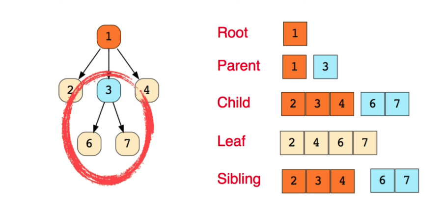
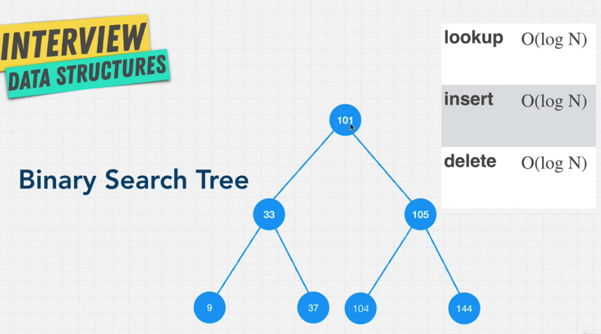
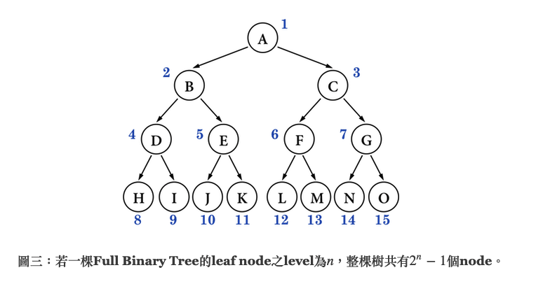
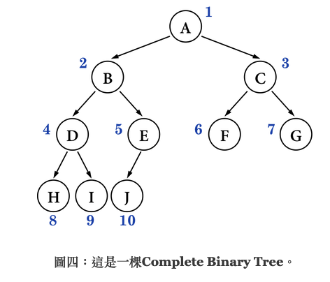
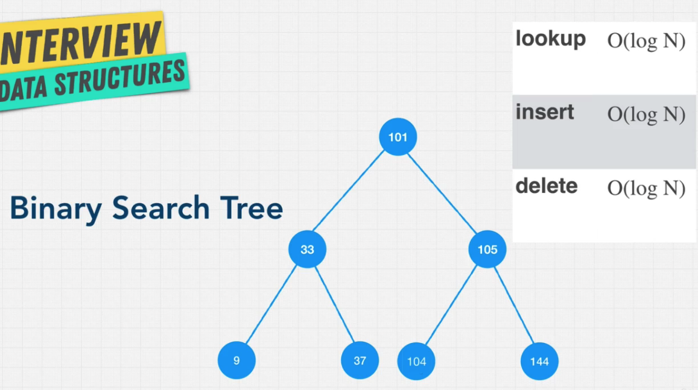
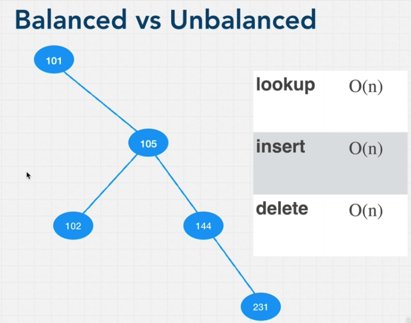
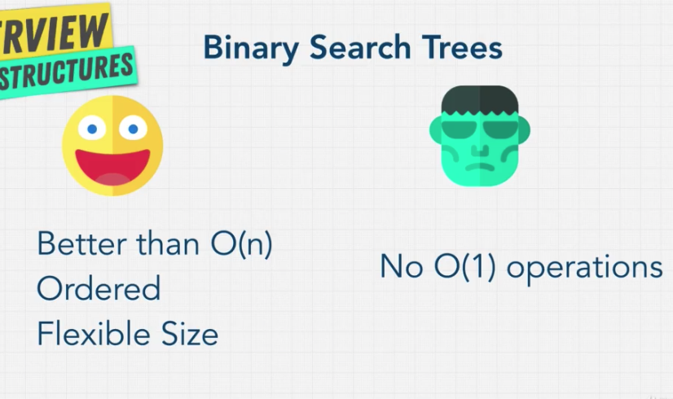
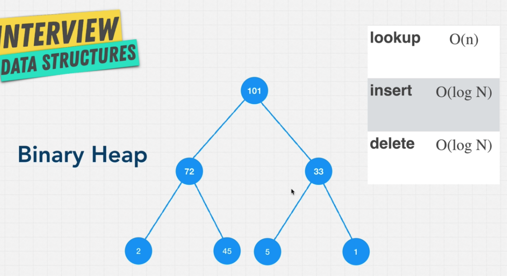
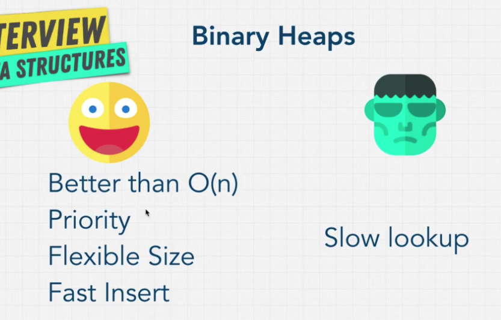

# Tree

## Introduce tree

最廣義的 tree 的定義並無規定一個節點能有多少個子節點

---

## Introduce binary tree

### Rules

- Each node can only have x child node ( 2 >= x >= 0 )
- Children could have **only one** parent node

---

## Introduce Perfect Binary Tree and Full Binary Tree

這邊要注意名詞定義，這邊影片的名詞定義跟其他人有出入，其他資訊可參考 [這裏](http://alrightchiu.github.io/SecondRound/binary-tree-introjian-jie.html)

### Full Binary Tree

- Full Binary Tree:
  - 所有 parent node 都有兩個 child node
  - 所有 leaf 都具有相同的 level
  - 由以上可推知
    - leaf node 的 level 為 n 故 整棵樹有 2^n - 1 個 node，例 level 為 3，整棵樹便有 7 個 node

---

### Complete Binary Tree

- Complete Binary Tree:
  - 若一棵樹高度為 h ，到 h-1 高度皆為 full node，在 h 高度時，node 是由左排到右。

---

## Big O

---

## Binary search tree

### Rules

- Left child is smaller than parent node
- Right child is bigger than parent node

### Balanced vs unbalanced

​ Balanced 它是一種每個節點的左右兩子樹高度差都不超過一的[二元樹]，若不平衡則會導致 時間複雜度變很差

### Pros and Cons

### Balanced BST example

- AVL Tree

  - [Animation](https://www.cs.usfca.edu/~galles/visualization/AVLtree.html)
  - [How it work](https://medium.com/basecs/the-little-avl-tree-that-could-86a3cae410c7)

- Red black tree
  - [Animation](https://www.cs.usfca.edu/~galles/visualization/RedBlack.html)
  - [How it Works](https://medium.com/basecs/painting-nodes-black-with-red-black-trees-60eacb2be9a5)

---

## Binary Heep

### 特性

- 每個 node 最多有兩個 child

- 同一階層要從左到右，不能跳過

- 如果是 max heap 的話 每個 node 要比子 node 還要大，min heap 則反之

- 如果是 max heap 的話 root 就會是這個 heap 的最大值

- 備註 binary heap 跟 javascript heap memory 沒有關係

- 本質來說 是一個完全二元樹 (completed binary tree)，也因為是完全二元樹，所以可以直接用 array 來實現，每一個 node 的左 child 就是 2\*parent + 1

- 在插入值時，會從最下層開始，然後依序比較每層的數字，決定上浮到第幾層，[展示](https://visualgo.net/en/heap?slide=1)
  
  

---

## Priority queue

### 特性

- 需要最大 or 最小的值先出，因此適合用 binary heap 的方式。
- 適合用 binary heap 來實作
