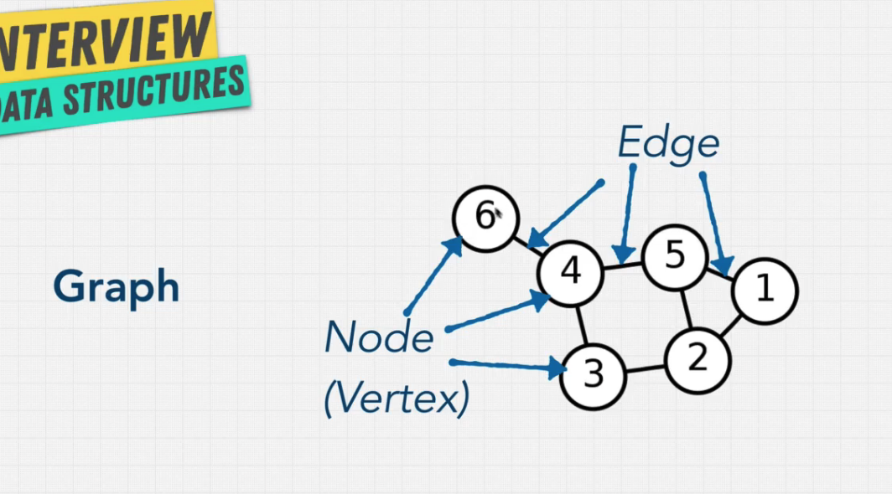
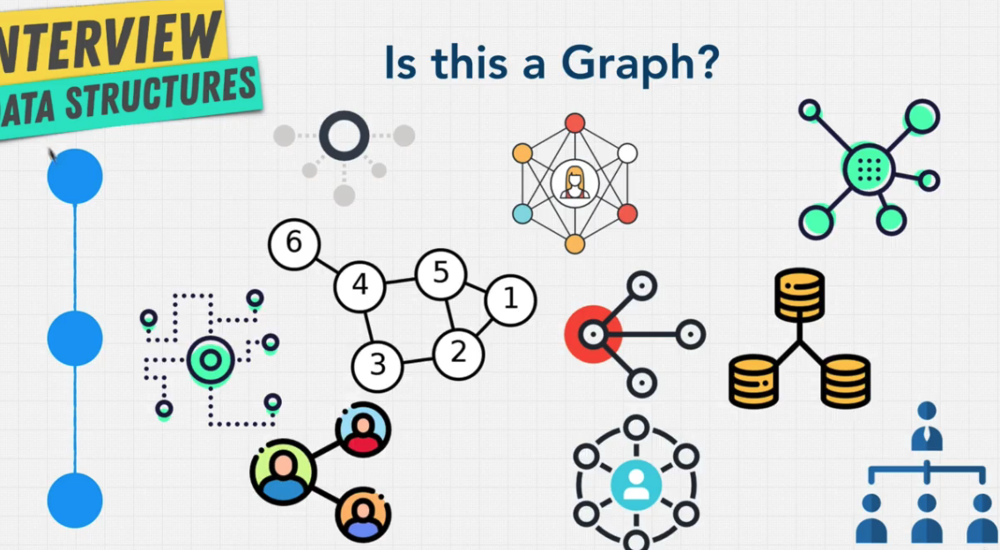
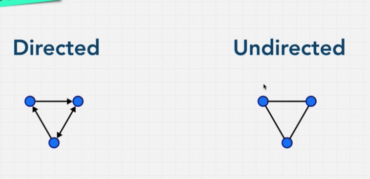
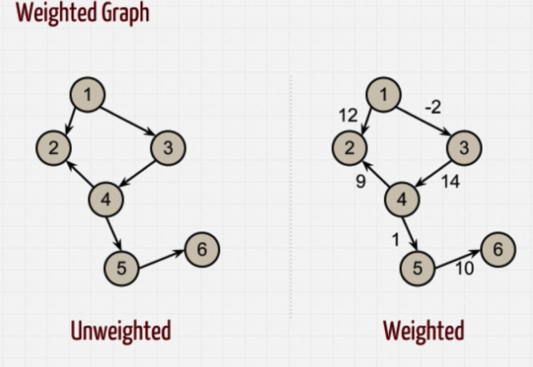
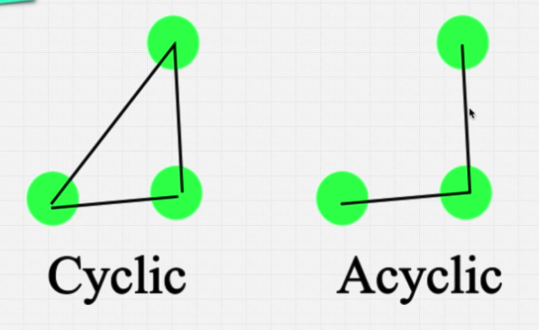
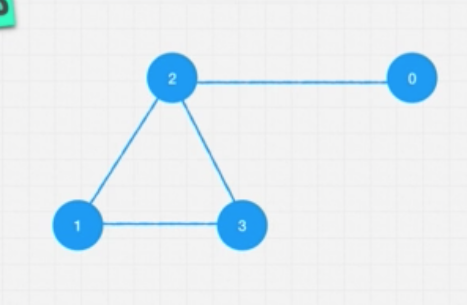
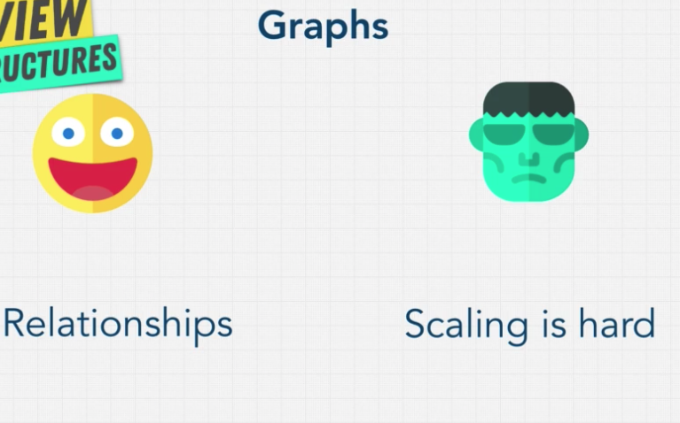

# Graphs

## 特性

- 由 node 與 edge 結合而成



- graph 總類有很多，以下都是 (link list 也是其中一種)



---

## Type of graph

- Directed vs Undirected

- 舉例 facebook 加好友就是 Undirected ，因為我們能看到彼此資訊。但是 Twitter 就不是，因為我們只能看到 follow 人的資訊。



- Weighted vs Unweighted

- Google map 就是 weighted graph



- Cyclic vs Acyclic



---

## Graph data



- Edge list

  將每個有 edge 對應到的 node ，放在 array，並用 array 表示，也可用 object 來做

  ```javascript
  const graph = [
    [0, 2],
    [2, 3],
    [2, 1],
    [1, 3],
  ];
  ```

- Adjacent list

  用 index 當作 node value，並將其對應到連接的 node，放在 index 裡。 舉例 value = 0 的 node，就用 index = 0 表示，0 連接到 2，故 index = 0 的地方就放入 [2]。也可用 object 來做

  ```javascript
  const graph = [[2], [2, 3], [0, 1, 2], [1, 2]];
  ```

- Adjacent matrix

  ```javascript
  const graph = [
    [0, 0, 1, 0], // [0, 0, 1, 0] 在此 index 0 裡面代表 node value 0， 因為 array[2] = 1，代表 0 與 2有連接
    [0, 0, 1, 1],
    [1, 1, 0, 1],
    [0, 1, 1, 0],
  ];
  ```

---

## Review


