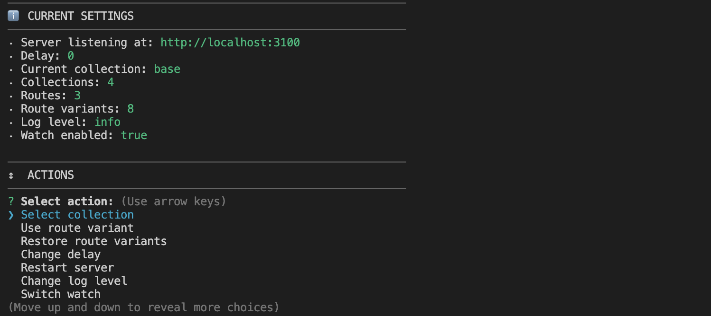
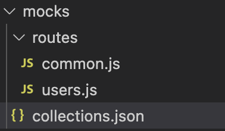
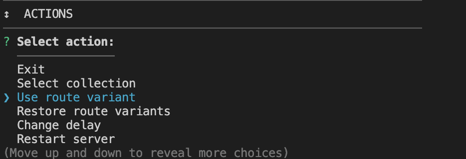
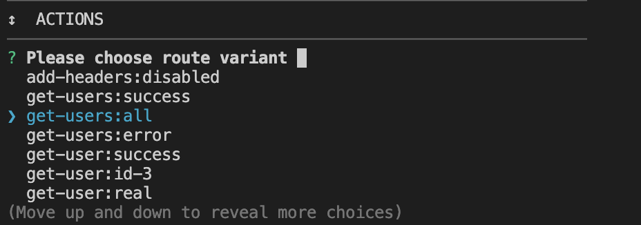
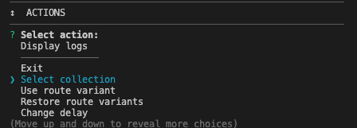
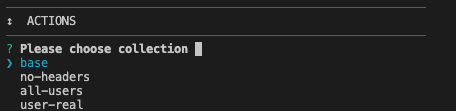
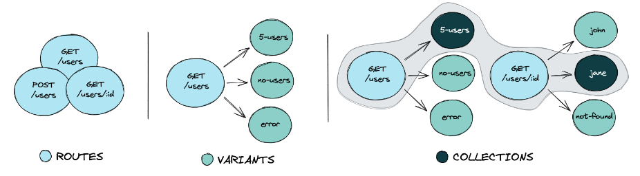

# Mocks Server 介紹

## 大綱

- 什麼是 mocks server
- 使用 mocks server 的好處
- 安裝 mocks server
- 介紹 mocks server 功能
  - Routes + Variants
  - Collection
- 結語

## 什麼是 mocks server

Mock 在英文裡面有模仿或模擬的意思，所以字面上 mocks server 我們可以讀作模擬伺服器，他可以為我們模擬 **各種** api 的 requeset/response，假裝我們真的有一台伺服器可以用。

## 使用 mocks server 的好處

在開發系統時，常常一個需求下來要很多 application server 一起動工，但時間有限，不可能等到彼此要串接的 server 都做完後，才輪到我們開始動工。所以在動工前各個 server 的工程師就會先討論完各個 server 該處理的範圍，input/output (這裡我們稱為 interface)也會在討論階段就定案。所以 mocks server 在這裡就能當作一台能模擬各種 interface 的 server 來使用。讓大家能做到並行的開發，來解省很多時間。

自己在做測試時，如果是接別人的 server 真實 api，有時候是別人的 server 有問題，反而讓自己開發的 server 有些情境很難測試，需要等別人修正完他們的 bug，才能繼續下去。有了 mocks server 就很容易模擬各個情境給自己用。

## 安裝 mocks server

這裡帶大家安裝的是這個 nodejs 套件 [Mocks server](https://www.mocks-server.org/docs/overview/)

- 安裝

```shell
npm i -D @mocks-server/main
```

- 在 package.json 檔案新增

```json
{
  "scripts": {
    "mocks": "mocks-server"
  }
}
```

- 啟動

```shell
npm run mocks
```

啟動完會看到終端機畫面變成如下：

再來就可以透過很簡單的設定就能控制 api 的行為

## 介紹 Mocks server 功能

執行完 npm run mocks 後，就會跑出一個 `/mocks` 資料夾，我們來看看官方在裡面設定好的 default 資料夾有哪些：



可以看到裡面還有一個 `/routes` 資料夾`/routes` 就是讓我們新增 api 的地方。而 `collection.json` 是讓我們來打包哪些 api 要放在一起的地方，晚點來介紹。

先來看官方提供的 `/mocks/user.js` 官方如何設定 api 當作範例，官方的 sample code 寫得滿好懂的

### Routes + Variants

```javascript
module.exports = [
  {
    id: 'get-users', // route id
    url: '/api/users', // url in express format
    method: 'GET', // HTTP method
    variants: [
      {
        id: 'success', // variant id
        type: 'json', // variant handler id
        options: {
          status: 200, // status to send
          body: USERS, // body to send
        },
      },
      {
        id: 'all', // variant id
        type: 'json', // variant handler id
        options: {
          status: 200, // status to send
          body: ALL_USERS, // body to send
        },
      },
      {
        id: 'error', // variant id
        type: 'json', // variant handler id
        options: {
          status: 400, // status to send
          // body to send
          body: {
            message: 'Error',
          },
        },
      },
    ],
  },
];
```

可以看到官方定義了一個 api path 為 `/api/users`, 且 http method 為 GET，然後將不同的回傳結果都寫進 `variaints` 這裡面，所以預期這隻 api 在 mockserver 裡面總共有三種不同的情況可以進行回傳。

那我們要怎麼控制這何時要回傳哪個 response 呢？ 我們可以直接透過終端機的選擇來選擇當下要回傳哪個 api response 如下圖，

---

選擇 use route variant 並按 enter:



---

選擇 想使用的 api response (這裡的選項是由 route_id + variant_id 組成，所以之後再加 api 時要切記 id 不能使用到重複的):



Variants 相關的 type 除了 JSON 還有 Text, File, Proxy... 很多可以使用。

---

### Collections

官方提供的 collection sample

```json
[
  {
    "id": "base",
    "routes": ["add-headers:enabled", "get-users:success", "get-user:success"]
  },
  {
    "id": "no-headers",
    "from": "base",
    "routes": ["add-headers:disabled"]
  },
  {
    "id": "all-users",
    "from": "base",
    "routes": ["get-users:all", "get-user:id-3"]
  },
  {
    "id": "user-real",
    "from": "no-headers",
    "routes": ["get-user:real"]
  }
]
```

代表裡面每一個 collection 都有一組自訂的 API，如 `id:base` 代表這個 collection 擁有三個 api 且 variant 也選好。比起用 route variant 一個個來切換 API，collection 更容易按照情境做一系列的 API 切換。`from` 還能繼承其他 collection 讓這個 config json 設定起來更彈性。

操作起來如下：

選到 `Select collection`:



選擇想要的 `Collection`:



---

- Routes: 代表想創造幾個 API 就必須要有幾個 Route。
- Variants: 代表那隻 API，想要有幾種回傳的方式(可能是結果 1，可能是結果 2，可能是 Error)
- Collections: 代表這個 Collection 已經做好 Route+Varaint 的組合包，可以按照情境來設定自己的組合包。

關係如下：



## 結語

個人對於 mocks server 真心覺得很讚，可以讓自己更專注在自己開發的 server 裡。當需求的 interface 都有開好，就能達到開發快、除錯快事半功倍的效果。
